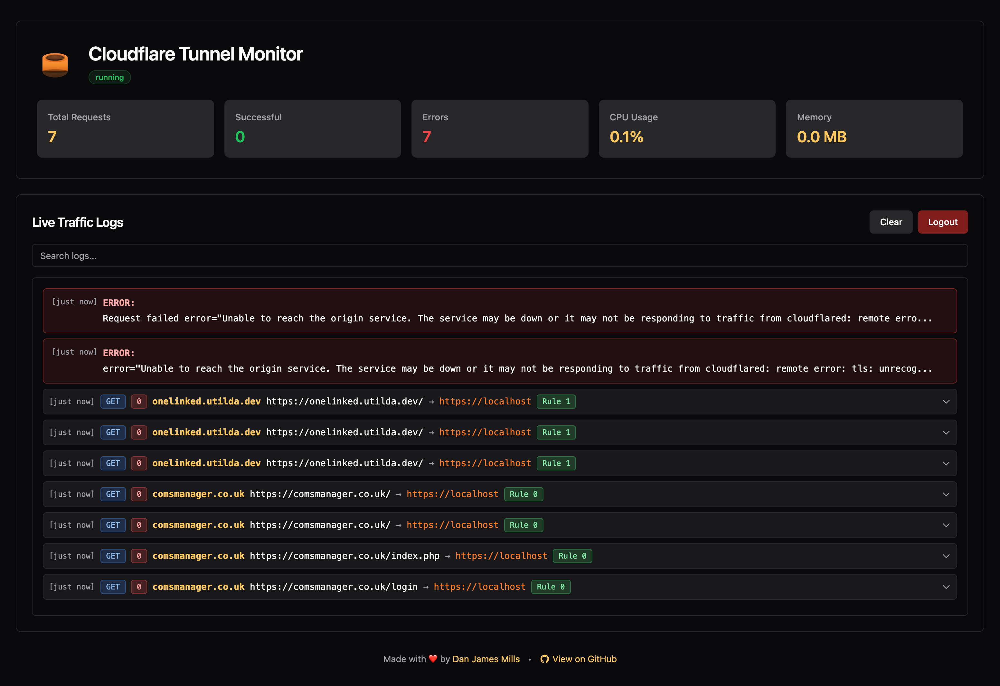

# Cloudflare Tunnel with Real-Time Dashboard

**Stop spending time digging through hard-to-read tunnel logs.** This project gives you a beautiful, real-time web dashboard to monitor your Cloudflare Tunnel traffic with instant visibility into every request, error, and connection.

## What is this?

This is a Docker-based Cloudflare Tunnel setup with an **optional monitoring dashboard** that makes it easy to see what's happening with your tunnel in real-time. Instead of parsing raw JSON logs or using `docker logs`, you get:

- 🎯 **Real-Time Web Dashboard** - Clean, modern interface showing live traffic
- 🔍 **Search & Filter** - Find specific requests instantly
- 📊 **Live Stats** - Request counts, success rates, CPU/memory usage
- 🎨 **Color-Coded Logs** - HTTP methods, status codes, and errors at a glance
- 📱 **Mobile Friendly** - Check your tunnel from anywhere
- 🔐 **Password Protected** - Secure access to your monitoring dashboard

### Why Use This?

**For the Tunnel:**
- **Privacy & Security**: Your home IP address remains hidden. All traffic is proxied through Cloudflare's global network, masking your actual location and protecting against direct attacks
- **No Port Forwarding**: No need to open ports on your router or configure complex firewall rules
- **DDoS Protection**: Built-in protection from Cloudflare's network
- **Static DNS**: DNS entries point to Cloudflare's network and never need updating, even if your home IP changes

**For the Dashboard:**
- **Stop Guessing**: See exactly which requests are hitting your tunnel and which services they're reaching
- **Spot Issues Fast**: Instantly identify 404s, 500s, and connection errors with color-coded badges
- **Debug Easily**: Search logs for specific paths, hosts, or error messages
- **Monitor Health**: Keep an eye on tunnel status, CPU, and memory usage

### Example Use Case

A popular setup is running this on a Raspberry Pi as your main gateway tunnel for your homelab. The Pi acts as a central entry point that forwards requests to other services on your local network (e.g., `192.168.1.10:8080`, `10.0.0.5:3000`). With the dashboard enabled, you can monitor all traffic flowing through your tunnel from any device on your network - perfect for troubleshooting routing rules or watching for suspicious activity.

> **Note**: While homelabs are a common use case, Cloudflare Tunnel works in any network environment - office networks, data centres, cloud instances, or anywhere you need secure external access. Additionally, Cloudflare Access allows you to add authentication (login/password protection, SSO, etc.) to any service exposed through the tunnel.

## Installation

Clone this repository:

```bash
git clone https://github.com/DanJamesMills/cloudflare-tunnel.git
cd cloudflare-tunnel
```

### Quick Setup (Recommended)

Run the setup script which will guide you through the process:

```bash
./setup.sh
```

The script will:
1. Prompt you for your Cloudflare Tunnel token
2. Optionally enable the web dashboard with custom credentials
3. Create the `.env` file automatically with your settings
4. Start the Docker container(s)

The setup script makes it easy to get started with both the tunnel and the optional monitoring dashboard in one go!

### Manual Setup

If you prefer to set up manually, continue with the steps below.

## Prerequisites

- Docker and Docker Compose installed
- A Cloudflare account
- A Cloudflare Tunnel created (see setup instructions below)

## Setup

### 1. Create a Cloudflare Tunnel

1. Log in to the [Cloudflare Zero Trust Dashboard](https://one.dash.cloudflare.com/)
2. Navigate to **Networks** → **Tunnels**
3. Click **Create a tunnel**
4. Choose **Cloudflared** as the connector
5. Give your tunnel a name
6. Copy the tunnel token (you'll need this in the next step)

### 2. Configure Environment Variables

Create a `.env` file in the project root:

```bash
TUNNEL_TOKEN=your_tunnel_token_here
```

Replace `your_tunnel_token_here` with the token from step 1.

### 3. Configure Your Tunnel Routes

In the Cloudflare Zero Trust Dashboard:

1. Select your tunnel
2. Go to the **Public Hostname** tab
3. Add routes to map domains to your local services (e.g., `app.yourdomain.com` → `http://localhost:3000`)

**Note**: DNS is configured once in the Cloudflare dashboard. The tunnel automatically maintains the connection, so DNS entries never need updating - even if your home IP address changes. Your domain always points to Cloudflare's network, which then routes to your tunnel.

## Usage

### Updating to Latest Version

When new updates are pushed to GitHub, run the update script to rebuild everything cleanly:

```bash
./update.sh
```

This will:
- Pull latest changes from GitHub
- Stop all containers
- Rebuild images without cache (ensures all changes are applied)
- Restart services

**Important**: Always use `./update.sh` after pulling updates to avoid Docker caching issues!

### Daily Operations

Start the tunnel:

```bash
docker compose up -d
```

Stop the tunnel:

```bash
docker compose down
```

View logs:

```bash
docker compose logs -f
```

**Monitor traffic in real-time (CLI)**:

```bash
./monitor.py
```

This shows a formatted, color-coded view of incoming requests with:
- HTTP method, status code, and path
- Which hostname is being accessed
- Which backend service is handling the request
- Ingress rule that matched (highlights Rule 2 when nothing matches)

**Monitor traffic in real-time (Web Dashboard)**:

The web dashboard provides a beautiful, responsive visual interface for monitoring your tunnel traffic in real-time.


**Quick Access:**
- **URL**: `http://localhost:9090`
- **Default Port**: 9090 (configurable in docker-compose.yml)

**If you used `./setup.sh`:** The dashboard is already configured with your chosen credentials. Just access it at `http://localhost:9090`

**Manual setup:** Uncomment the `dashboard` service in `docker-compose.yml` and add credentials to your `.env` file:

```bash
# Add these to your .env file
DASHBOARD_USER=your_username
DASHBOARD_PASSWORD=your_secure_password
DASHBOARD_SECRET_KEY=your-random-secret-key-here
```

Then start the dashboard:

```bash
docker compose up -d dashboard
```

**Features:**
- 📊 Real-time traffic monitoring with color-coded HTTP requests
- 💻 Live CPU and memory usage statistics
- 🔍 Highlights Rule 2 (404 catch-all) when routes aren't matched
- 🔒 Password protected with session-based authentication
- 🎨 Dark theme terminal-style UI
- 📱 Fully responsive (works on desktop, tablet, and mobile)
- ⏱️ Smart timestamps (relative time for recent logs, full date/time for older ones)

**Security Note:** The dashboard runs on localhost by default. To access remotely, add it as a public hostname in your Cloudflare Tunnel configuration with Cloudflare Access enabled for additional security.

Check tunnel status:

```bash
docker compose ps
```

## How It Works

The Docker container runs `cloudflared` which establishes a secure tunnel to Cloudflare's edge network. When someone accesses your configured domain, Cloudflare routes the traffic through the tunnel to your local service.

The tunnel will automatically restart unless explicitly stopped, making it reliable for long-running services.

### Network Configuration

The container uses Docker's default bridge network, which automatically provides access to your host machine and LAN IPs (e.g., `10.0.x.x`, `192.168.x.x`). This means you can route traffic to any service on your local network without additional network configuration in the docker-compose.yml file.

**Alternative: Using a Proxy Network**

You can also create a dedicated proxy network and connect multiple services to it. This allows the tunnel to communicate with other Docker containers by their service names:

1. Create a proxy network:
   ```bash
   docker network create proxy
   ```

2. Update your `docker-compose.yml` to use the external network:
   ```yaml
   services:
     cloudflared:
       # ... existing configuration ...
       networks:
         - proxy

   networks:
     proxy:
       external: true
   ```

3. Add the same network to any other services you want to expose through the tunnel:
   ```yaml
   networks:
     - proxy
   ```

Now you can route traffic to those services using their container names (e.g., `http://my-app:3000`).

## Troubleshooting

### "Unable to reach the origin service" Error

If you see an error like `dial tcp 10.0.x.x:80: i/o timeout`, the tunnel container may not be able to reach your host network properly.

**Solution 1: Use host.docker.internal (Recommended for macOS/Windows)**

In your Cloudflare dashboard, change the service URL to use `host.docker.internal`:
```
http://host.docker.internal:8080
```

**Solution 2: Add extra_hosts to docker-compose.yml**

Add this to your `docker-compose.yml` under the `cloudflared` service:
```yaml
services:
  cloudflared:
    # ... existing configuration ...
    extra_hosts:
      - "host.docker.internal:host-gateway"
```

Then restart: `docker compose down && docker compose up -d`

**Solution 3: Find your host's actual IP on the Docker network**

```bash
# Get the gateway IP that Docker containers use to reach the host
docker network inspect bridge | grep Gateway
```

Use this IP in your Cloudflare dashboard (e.g., `http://172.17.0.1:8080`)

**For services on other machines in your LAN:**

The LAN IPs like `10.0.40.100` should work from the container. Verify:
```bash
docker exec cloudflared-tunnel ping 10.0.40.100
docker exec cloudflared-tunnel curl http://10.0.40.100:80
```

If ping/curl fail, there may be a firewall blocking Docker network ranges on that device.

### View Tunnel Logs

Check the logs for detailed error messages:
```bash
docker compose logs -f
```

### Understanding Ingress Rules in Logs

When viewing tunnel logs, you may see entries like `ingressRule=2`. This refers to the internal ID of the rule that handled the request:

- **Rule 0 and 1**: Your actual configured websites/services in the Cloudflare dashboard
- **Rule 2**: The default catch-all rule - "If nothing matches, return 404"

If you consistently see `ingressRule=2` in logs for requests that should be hitting your services, it means:
- The hostname or path doesn't match any of your configured public hostname rules
- You may need to add or update routes in the Cloudflare Zero Trust Dashboard under your tunnel's **Public Hostname** tab

**Note**: Debug logging is enabled by default in this configuration (`--loglevel debug`) to help with troubleshooting. Don't worry about logs growing indefinitely - the docker-compose.yml includes automatic log rotation (max 10MB per file, 3 files max = 30MB total). You can remove the `--loglevel debug` flag from the command in `docker-compose.yml` if you want less verbose logging in production.

## Security Notes

- Keep your `.env` file secure and never commit it to version control
- The `.env` file is already in `.gitignore` (or should be)
- Cloudflare Tunnel provides built-in DDoS protection and doesn't expose your origin IP